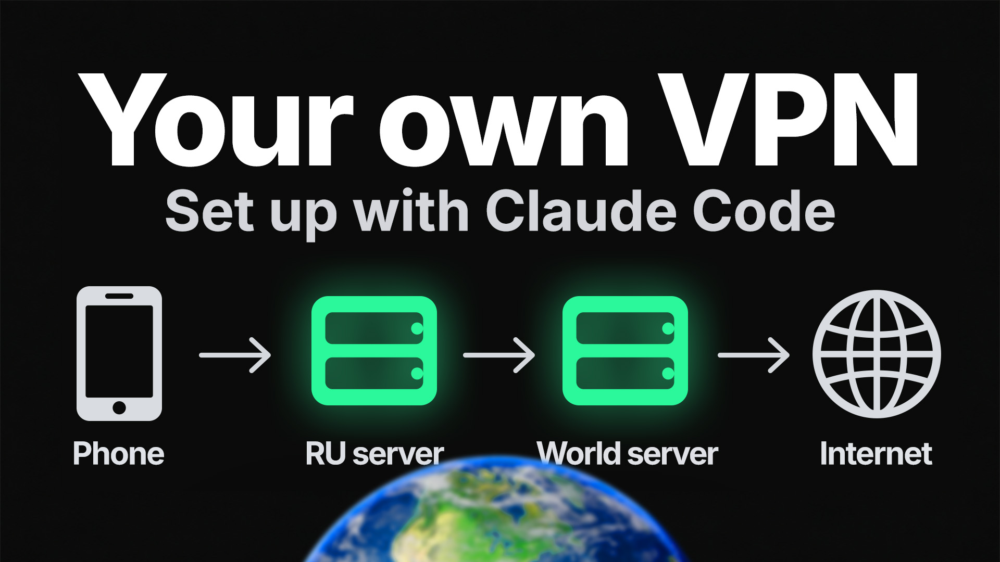
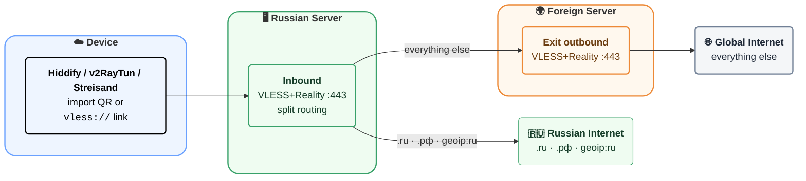

# Russian VPN Setup Plugin (Claude Code)

<p align="center">
  
</p>

4 steps to your own VPN that can be used by **your whole family and unlimited friends**.
- [1. Buy 2 servers (Russian + foreign)](#1-buy-2-servers-russian--foreign)
- [2. Install Claude Code plugin](#2-install-claude-code-plugin)
- [3. Paste server credentials and run prompt](#3-paste-server-credentials-and-run-prompt)
- [4. Import final `vless://` link into app](#4-import-final-vless-link-into-app)

> [!IMPORTANT]
> Estimated monthly cost is usually about **400-1500 RUB/month total** for 2 VPS.


## How it works

This plugin sets up 2 servers:
- **Russian server** for client connection.
- **Foreign server** for internet exit.

It returns a ready `vless://` link (and QR) for your app.

Why this setup:

* **TSPU checks SNI against IP.** If the TLS handshake says `ya.ru` but the IP belongs to a European host, the connection is dropped. SSH opens fine; port 443 times out.
* **TSPU freezes sessions to foreign servers.** Once a TCP session accumulates ~15–20 KB, packets stop arriving.
* **Russian relay is the solution (for now).** For TSPU, traffic `client → Russian server` looks like ordinary domestic exchange. The next hop `Russian server → foreign exit` is server-to-server traffic, which is filtered far less aggressively. The final destination is hidden inside the encrypted tunnel.

Read more: [habr.com/ru/articles/979128](https://habr.com/ru/articles/979128/), [habr.com/ru/articles/985674](https://habr.com/ru/articles/985674/)

# Scheme (how traffic moves)



## 1. Buy 2 servers (Russian + foreign)

Best choice: **VDSina.ru** (Russian side) + **VDSina.com** (foreign side).  
Official pages: [VDSina.ru](https://vdsina.ru/en/pricing/standard), [VDSina.com](https://www.vdsina.com/pricing/standard)

| Russian servers (left) | Foreign servers (right) |
|---|---|
| **Best:** [VDSina.ru](https://vdsina.ru/en/pricing/standard) | **Best:** [VDSina.com](https://www.vdsina.com/pricing/standard) |
| [Selectel](https://selectel.ru/services/cloud/servers/) | [Hetzner](https://www.hetzner.com/cloud) |
| [Timeweb Cloud](https://timeweb.cloud/) | [Contabo](https://contabo.com/en/vps/) |
| [RUVDS](https://ruvds.com/) | [netcup](https://www.netcup.com/en/server/vps) |

## 2. Install Claude Code plugin
```text
/plugin marketplace add https://github.com/Zelenov/claude-code-ru-vpn-plugins.git
/plugin install vpn-russian@ru-vpn-marketplace
```

## 3. Paste server credentials and run prompt

```text
Servers:
Foreign server
<PUT_FOREIGN_SERVER_IP_HERE>
root
<PUT_FOREIGN_ROOT_PASSWORD_HERE>

Russian server
<PUT_RU_SERVER_IP_HERE>
root
<PUT_RU_ROOT_PASSWORD_HERE>

Use plugin vpn-russian and build a full working chain:
1) server access and base hardening
2) install and configure 3x-ui on both servers
3) configure foreign VLESS+Reality node
4) configure Russian relay + bridge to foreign node
5) create user links
6) return final links + validation checklist
```

Replace only these values:
- `<PUT_FOREIGN_SERVER_IP_HERE>`
- `<PUT_FOREIGN_ROOT_PASSWORD_HERE>`
- `<PUT_RU_SERVER_IP_HERE>`
- `<PUT_RU_ROOT_PASSWORD_HERE>`

## 4. Import final `vless://` link into app

Expected result from the skill flow:
- You get a working `vless://...` link for connection to the **Russian server**.

Final step:
- Copy this `vless://...` link (or QR) and import it into one of the apps below.

## 5. When something breaks, or you need to add a person

The plugin repairs as well as installs. Ready-made prompts:

**Add a user** (the text after `#` in the link is the connection name shown in the app):

```text
Use plugin vpn-russian. Add a new bridge user "masha" on the Russian relay,
add routing rules, restart x-ui, test from the relay, and give me a vless:// link
and QR with "#masha" as the name.
```

**VPN stopped working** (every bridge user has no internet):

```text
Use plugin vpn-russian. VPN is down — check what's up. Check both servers, then test
the relay → exit leg from the relay itself (openssl, ss, OOM history). If connections
opened from the relay to the exit lose data while the reverse direction works,
set up the reverse SSH tunnel from vpn-bridge and re-test.
```

Known as of 2026-09: on a Russia → Netherlands pair, after months of service, connections
opened by the **Russian** server towards the foreign one started losing all data (the
handshake completes, then silence - even SSH). The reverse direction works. The plugin moves
the bridge onto a reverse SSH tunnel hosted by the foreign server; user links do not change.

## 6. Apps to import the vless link

| Platform | Happ Proxy Utility Plus | Hiddify | v2RayTun | Streisand |
|---|---|---|---|---|
| Android | [Google Play (Happ)](https://play.google.com/store/apps/details?id=com.happproxy) | **Best choice:** [Google Play](https://play.google.com/store/apps/details?id=app.hiddify.com) | [Google Play](https://play.google.com/store/apps/details?id=com.v2raytun.android) | - |
| iOS | **Best choice:** [App Store (Happ Proxy Utility Plus)](https://apps.apple.com/ru/app/happ-proxy-utility-plus/id6746188973?l=en-GB) | [App Store](https://apps.apple.com/us/app/hiddify-proxy-vpn/id6596777532) | [App Store](https://apps.apple.com/us/app/v2raytun/id6476628951) | [App Store](https://apps.apple.com/us/app/streisand/id6450534064) |
| Windows | [x64 installer (Happ)](https://github.com/Happ-proxy/happ-desktop/releases/latest/download/setup-Happ.x64.exe) | **Best choice:** [Windows download](https://app.hiddify.com/win) | - | - |
| macOS | [App Store (Happ)](https://apps.apple.com/us/app/happ-proxy-utility/id6504287215), [Universal DMG](https://github.com/Happ-proxy/happ-desktop/releases/latest/download/Happ.macOS.universal.dmg) | **Best choice:** [macOS download](https://app.hiddify.com/mac) | [App Store](https://apps.apple.com/us/app/v2raytun/id6476628951) | - |
| Linux | [DEB](https://github.com/Happ-proxy/happ-desktop/releases/latest/download/Happ.linux.x64.deb), [RPM](https://github.com/Happ-proxy/happ-desktop/releases/latest/download/Happ.linux.x64.rpm), [PKG (Arch)](https://github.com/Happ-proxy/happ-desktop/releases/latest/download/Happ.linux.x64.pkg.tar.zst) | **Best choice:** [GitHub releases](https://github.com/hiddify/hiddify-app/releases) | - | - |
