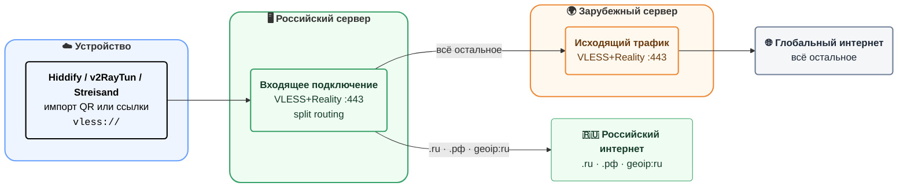

# Плагин для настройки российского VPN (Claude Code)

4 шага до собственного VPN, которым сможет пользоваться **вся ваша семья и неограниченное количество друзей**.

* [1. Купить 2 сервера (российский + зарубежный)](#1-купить-2-сервера-российский--зарубежный)
* [2. Установить плагин Claude Code](#2-установить-плагин-claude-code)
* [3. Вставить данные серверов и запустить prompt](#3-вставить-данные-серверов-и-запустить-prompt)
* [4. Импортировать итоговую ссылку `vless://` в приложение](#4-импортировать-итоговую-ссылку-vless-в-приложение)

> [!IMPORTANT]
> Ориентировочная стоимость обычно составляет около **400–1500 ₽/месяц суммарно** за 2 VPS.

---

## Как это работает

Этот плагин настраивает 2 сервера:

* **Российский сервер** — для подключения клиента.
* **Зарубежный сервер** — для выхода в интернет.

На выходе вы получаете готовую ссылку `vless://` (и QR-код) для приложения.

Зачем нужна такая схема:

* **ТСПУ проверяет SNI против IP.** Если в TLS-рукопожатии написано `ya.ru`, а IP — европейский хостинг, соединение обрывается. По SSH машина открывается, по 443 — таймаут.
* **ТСПУ замораживает сессии к зарубежным серверам.** Как только TCP-сессия набирает ~15–20 КБ, пакеты перестают приходить.
* **Российский relay — решение (пока что).** Для ТСПУ трафик `клиент → российский сервер` выглядит как обычный внутренний обмен. Дальше `российский сервер → зарубежный exit` — это уже межсерверный обмен, который фильтруется значительно слабее. Конечное назначение скрыто внутри зашифрованного туннеля.

Подробнее: [habr.com/ru/articles/979128](https://habr.com/ru/articles/979128/), [habr.com/ru/articles/985674](https://habr.com/ru/articles/985674/)

---

# Схема (как движется трафик)



## 1. Купить 2 сервера (российский + зарубежный)

Лучший вариант: **VDSina.ru** (российская сторона) + **VDSina.com** (зарубежная сторона).
Официальные страницы:

* [VDSina.ru](https://vdsina.ru/en/pricing/standard?utm_source=chatgpt.com)
* [VDSina.com](https://www.vdsina.com/pricing/standard?utm_source=chatgpt.com)

| Российские серверы (слева) | Зарубежные серверы (справа) |
| --- | --- |
| **Лучший выбор:** [VDSina.ru](https://vdsina.ru/en/pricing/standard?utm_source=chatgpt.com) | **Лучший выбор:** [VDSina.com](https://www.vdsina.com/pricing/standard?utm_source=chatgpt.com) |
| [Selectel](https://selectel.ru/services/cloud/servers/?utm_source=chatgpt.com) | [Hetzner](https://www.hetzner.com/cloud?utm_source=chatgpt.com) |
| [Timeweb Cloud](https://timeweb.cloud/?utm_source=chatgpt.com) | [Contabo](https://contabo.com/en/vps/?utm_source=chatgpt.com) |
| [RUVDS](https://ruvds.com/?utm_source=chatgpt.com) | [netcup](https://www.netcup.com/en/server/vps?utm_source=chatgpt.com) |

## 2. Установить плагин Claude Code

```text
/plugin marketplace add https://github.com/Zelenov/claude-code-ru-vpn-plugins.git
/plugin install vpn-russian@ru-vpn-marketplace
```

## 3. Вставить данные серверов и запустить prompt

```text
Servers:
Foreign server
<PUT_FOREIGN_SERVER_IP_HERE>
root
<PUT_FOREIGN_ROOT_PASSWORD_HERE>

Russian server
<PUT_RU_SERVER_IP_HERE>
root
<PUT_RU_ROOT_PASSWORD_HERE>

Use plugin vpn-russian and build a full working chain:
1) server access and base hardening
2) install and configure 3x-ui on both servers
3) configure foreign VLESS+Reality node
4) configure Russian relay + bridge to foreign node
5) create user links
6) return final links + validation checklist
```

Замените только эти значения:

* `<PUT_FOREIGN_SERVER_IP_HERE>`
* `<PUT_FOREIGN_ROOT_PASSWORD_HERE>`
* `<PUT_RU_SERVER_IP_HERE>`
* `<PUT_RU_ROOT_PASSWORD_HERE>`

## 4. Импортировать итоговую ссылку `vless://` в приложение

Ожидаемый результат работы:

* Вы получаете рабочую ссылку `vless://...` для подключения к **российскому серверу**.

Последний шаг:

* Скопируйте эту ссылку `vless://...` (или QR-код) и импортируйте её в одно из приложений ниже.

## 5. Приложения для импорта ссылки VLESS

| Платформа | Happ Proxy Utility Plus | Hiddify | v2RayTun | Streisand |
| --- | --- | --- | --- | --- |
| Android | [Google Play (Happ)](https://play.google.com/store/apps/details?id=com.happproxy) | **Лучший выбор:** [Google Play (Hiddify)](https://play.google.com/store/apps/details?id=app.hiddify.com&utm_source=chatgpt.com) | [Google Play (v2RayTun)](https://play.google.com/store/apps/details?id=com.v2raytun.android&utm_source=chatgpt.com) | - |
| iOS | **Лучший выбор:** [App Store (Happ Proxy Utility Plus)](https://apps.apple.com/ru/app/happ-proxy-utility-plus/id6746188973?l=en-GB) | [App Store (Hiddify)](https://apps.apple.com/us/app/hiddify-proxy-vpn/id6596777532?utm_source=chatgpt.com) | [App Store (v2RayTun)](https://apps.apple.com/us/app/v2raytun/id6476628951?utm_source=chatgpt.com) | [App Store (Streisand)](https://apps.apple.com/us/app/streisand/id6450534064?utm_source=chatgpt.com) |
| Windows | [x64 installer (Happ)](https://github.com/Happ-proxy/happ-desktop/releases/latest/download/setup-Happ.x64.exe) | **Лучший выбор:** [Windows download (Hiddify)](https://app.hiddify.com/win?utm_source=chatgpt.com) | - | - |
| macOS | [App Store (Happ)](https://apps.apple.com/us/app/happ-proxy-utility/id6504287215), [Universal DMG](https://github.com/Happ-proxy/happ-desktop/releases/latest/download/Happ.macOS.universal.dmg) | **Лучший выбор:** [macOS download (Hiddify)](https://app.hiddify.com/mac?utm_source=chatgpt.com) | [App Store (v2RayTun)](https://apps.apple.com/us/app/v2raytun/id6476628951?utm_source=chatgpt.com) | - |
| Linux | [DEB](https://github.com/Happ-proxy/happ-desktop/releases/latest/download/Happ.linux.x64.deb), [RPM](https://github.com/Happ-proxy/happ-desktop/releases/latest/download/Happ.linux.x64.rpm), [PKG (Arch)](https://github.com/Happ-proxy/happ-desktop/releases/latest/download/Happ.linux.x64.pkg.tar.zst) | **Лучший выбор:** [GitHub releases (Hiddify)](https://github.com/hiddify/hiddify-app/releases?utm_source=chatgpt.com) | - | - |
